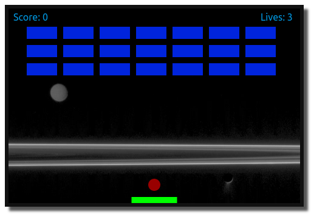
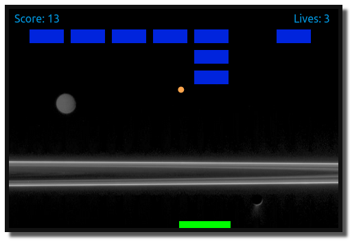

# Cosmic Breakout!

<figure>
     
    <figcaption>Cosmic Breakout! starting screen</figcaption>
</figure>
<figure>
    
    <figcaption>Cosmic Breakout! in play with decreased ball size and color change</figcaption>
</figure>

### Download and Local Deployment

This is about as simple as a webpage can get: an HTML file, a JavaScript file, and a CSS file. If you want to run this locally you only need clone the project and run a server like [Live Server](https://github.com/ritwickdey/vscode-live-server) for [VS Code](https://code.visualstudio.com). Drag and dropping `index.html` into a browser window might generate a <a href="https://developer.mozilla.org/en-US/docs/Web/HTTP/CORS/Errors/CORSRequestNotHttp" target="_blank">CORS error</a> if you are not seeing anything generated by JavaScript. Check your browser's Web Developer Tools to see if there are any CORS errors.

### Deployed Site

See it in action: <a href="https://reotch.github.io/breakout/" target="_blank">https://reotch.github.io/breakout</a>

### Developer Info

#### Richard Sandrok did a solo hack on this one:

- <a href="https://sandrok.com" target="_blank">Portfolio Site</a>
- <a href="https://github.com/reotch" target="_blank">Github</a>
- <a href="https://linkedin.com/in/sandrok" target="_blank">LinkedIn</a>
- <a href="https://twitter.com/richardsandrok" target="_blank">Twitter @richardsandrok</a>

### Background Images from NASA JPL

- Background: https://images.nasa.gov/details-PIA08216
- Alternate Background (not currently used): https://images.nasa.gov/details-PIA17143